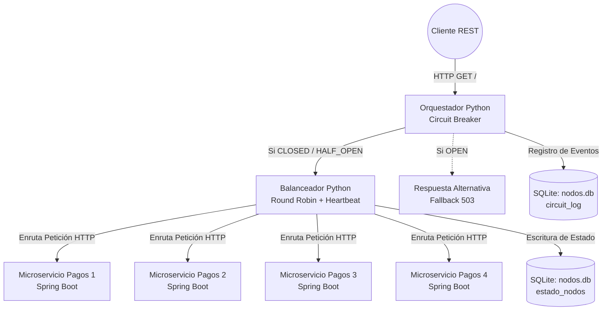
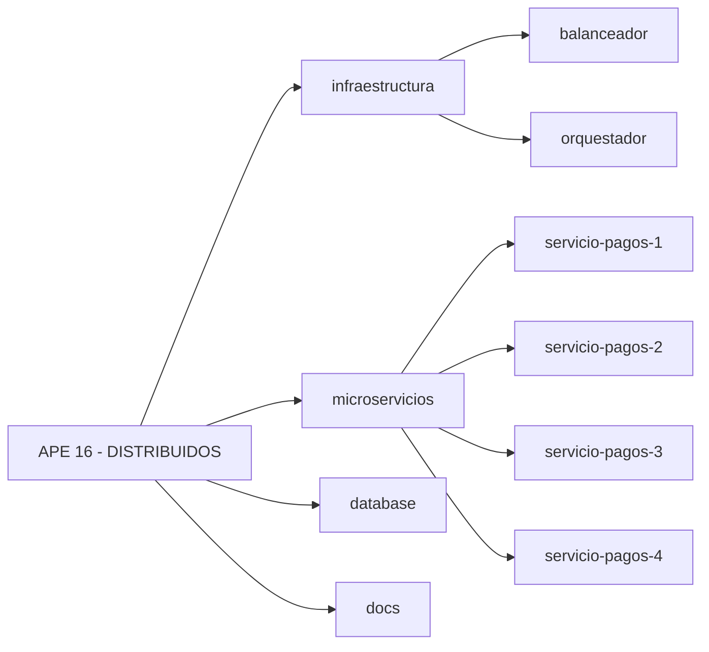

# Documentación Arquitectónica - APE 16 Distribuidos

Este documento fundamenta las decisiones tomadas durante la refactorización hacia **Clean Architecture** (Simplificada) solicitada para la práctica universitaria. Está diseñado para guiar tu defensa académica.

## Diagrama de Flujo de la Arquitectura Distribuida

## Estructura de Directorios (Monorepo)

## Clean Architecture en Spring Boot

Para los microservicios desarrollados en Java, aplicamos una arquitectura limpia simplificada enfocada en la Inversión de Dependencias (SOLID):

### Capas Implementadas:
1. **`domain`**: Contiene la lógica central y las entidades (`Pago.java`). Esta capa no tiene ninguna dependencia hacia afuera (ni Spring Framework, ni HTTP, ni Bases de Datos). Es Java puro.
2. **`application`**: Coordina los casos de uso (`PagoApplicationService`) y define los contratos de entrada/salida (`PagoResponseDTO`). Depende del `domain`, pero no de la infraestructura.
3. **`infrastructure`**: Es el "borde" del sistema. Contiene el controlador web (`PagosController`) y los servicios que interactúan con hardware o librerías externas (`NetworkService` que abstrae el uso de `InetAddress`).
4. **`config`**: Contiene el archivo `application.properties`.

### ¿Por qué esta arquitectura es superior al patrón MVC tradicional?
En el patrón MVC clásico, es común que la capa de negocio (`Service`) conozca detalles de la web o de la infraestructura (ej. leer cabeceras HTTP o interactuar directamente con librerías de red). Al extraer `NetworkService` hacia la capa de `infrastructure`, logramos que el `PagoApplicationService` cumpla el Principio de Responsabilidad Única (SRP): Solo coordina la creación del pago, sin importarle cómo la máquina calcula su propia IP.

## Decisiones Arquitectónicas (Python)

Los componentes `orquestador` y `balanceador` también migrarán a una separación de capas equivalente:
* **`domain`**: Lógica abstracta de la máquina de estados del Circuit Breaker (CLOSED, OPEN, HALF_OPEN) o lógica matemática del Round Robin.
* **`application`**: Lógica de "Heartbeat" como servicio asíncrono.
* **`infrastructure`**: Levantamiento del servidor HTTP en puertos 8000 y 8080 y la escritura directa en los archivos `.db` (SQLite).
* **`main.py`**: El punto de entrada que "ensambla" el programa (Inyección de dependencias manual).
