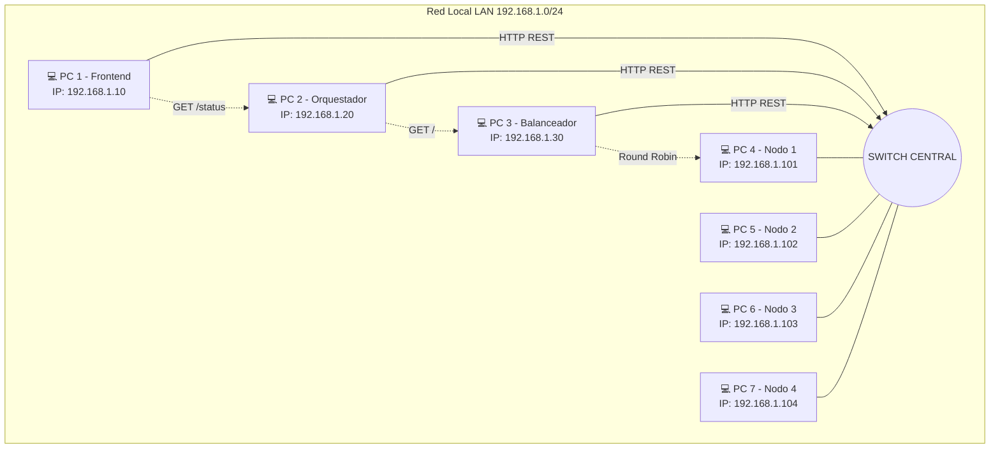

# Plan B: Despliegue Distribuido en Red Local (LAN)

Aunque el ecosistema principal del proyecto está completamente dockerizado y optimizado para ejecutarse en una sola máquina mediante `docker compose`, este documento detalla la estrategia para desplegar la arquitectura de manera físicamente distribuida. 

Este enfoque responde a la necesidad de demostrar un entorno distribuido real, donde las comunicaciones atraviesen hardware de red físico (un Switch) superando las latencias de la capa OSI.

## 1. Topología de Red y Asignación de Hardware

Para este escenario, asumimos la disponibilidad de **7 computadoras independientes** conectadas mediante cable Ethernet a un Switch central, operando dentro de la subred `192.168.1.0/24`.

| Equipo | Rol en la Arquitectura | Dirección IP (LAN) | Puerto Expuesto |
| :--- | :--- | :--- | :--- |
| **PC 1** | Frontend Dashboard (React) | `192.168.1.10` | `80` (o `5173`) |
| **PC 2** | Orquestador / BFF (Python) | `192.168.1.20` | `8000` |
| **PC 3** | Balanceador de Carga (Python) | `192.168.1.30` | `8080` |
| **PC 4** | Microservicio Pagos 1 (Java) | `192.168.1.101` | `9001` |
| **PC 5** | Microservicio Pagos 2 (Java) | `192.168.1.102` | `9002` |
| **PC 6** | Microservicio Pagos 3 (Java) | `192.168.1.103` | `9003` |
| **PC 7** | Microservicio Pagos 4 (Java) | `192.168.1.104` | `9004` |

> [!NOTE] 
> Todas las PCs deben tener el Firewall de Windows configurado para **permitir el tráfico entrante** en sus respectivos puertos.

## 2. Diagrama de Despliegue Físico



## 3. Modificaciones de Configuración

Para migrar del esquema Docker (donde usábamos resolución DNS interna como `http://balanceador:8080`) al esquema LAN, solo necesitamos alterar los archivos de configuración sin tocar una sola línea del código fuente.

### A. Balanceador (PC 3)
El Balanceador necesita saber en qué IPs físicas están los nodos de Java. Modificaremos el archivo `infraestructura/balanceador/config/nodes_config.json`:
```json
[
    {"id": "Integrante1", "url": "http://192.168.1.101:9001"},
    {"id": "Integrante2", "url": "http://192.168.1.102:9002"},
    {"id": "Integrante3", "url": "http://192.168.1.103:9003"},
    {"id": "Integrante4", "url": "http://192.168.1.104:9004"}
]
```

### B. Orquestador (PC 2)
El Orquestador debe apuntar a la IP del Balanceador. En lugar de usar `localhost` o el host de Docker, exportaremos la variable de entorno en la terminal de la PC 2 antes de ejecutarlo:
```powershell
$env:LOAD_BALANCER_URL="http://192.168.1.30:8080/"
$env:PORT="8000"
python main.py
```

### C. Frontend (PC 1)
El Frontend, que corre en el navegador del cliente (o en la PC conectada al proyector), necesita hacer Fetch a la IP del Orquestador. En la carpeta `frontend-dashboard`, creamos un archivo `.env` antes de compilar o ejecutar:
```env
VITE_API_URL=http://192.168.1.20:8000
```
Luego ejecutamos `npm run dev -- --host 0.0.0.0`.

## 4. Secuencia de Arranque (Startup)

El sistema debe encenderse en orden inverso a la dependencia del tráfico para evitar falsos positivos de nodos caídos en los primeros segundos.

1. **Paso 1 (Nodos - PC 4 a PC 7):** Ejecutar `mvn spring-boot:run` en las cuatro computadoras simultáneamente. Esperar a que el banner de Spring Boot indique "Started".
2. **Paso 2 (Balanceador - PC 3):** Arrancar `python main.py`. El hilo secundario del Heartbeat comenzará inmediatamente a sondear las IPs `192.168.1.10X`.
3. **Paso 3 (Orquestador - PC 2):** Arrancar `python main.py`. El Circuit Breaker inicia en estado `CLOSED`.
4. **Paso 4 (Frontend - PC 1):** Iniciar el Dashboard en el navegador apuntando a `http://localhost:5173`. Verificaremos que el Polling muestre 4 nodos activos.

## 5. Guía de Defensa (Simulacro de Fallos Físicos)

Para evidenciar el comportamiento del sistema distribuido ante el jurado, se recomienda seguir este guion interactivo:

1. **Tolerancia a Caídas Parciales:**
   - **Acción:** Desconectar físicamente el cable de red de la PC 4, o presionar `Ctrl+C` en su consola Java.
   - **Reacción:** El jurado podrá ver en el proyector (Dashboard) que el Heartbeat detecta la ausencia tras 1 o 2 segundos (timeout). El nodo pasará a rojo (`INACTIVO`).
   - **Validación:** Presionar "Procesar Pago". El tráfico HTTP fluirá `PC1 -> PC2 -> PC3`, y el Balanceador (PC 3) excluirá la IP `192.168.1.101`, derivando la carga equitativamente hacia PC 5, PC 6 y PC 7.
2. **Recuperación Automática:**
   - **Acción:** Volver a encender la aplicación en la PC 4 (o reconectar el cable).
   - **Reacción:** El Dashboard mostrará que el nodo vuelve a 🟢. El tráfico volverá a ser enviado allí en el siguiente turno del Round Robin.
3. **Caída Crítica y Circuit Breaker:**
   - **Acción:** Presionar agresivamente `Ctrl+C` en las PCs 5, 6 y 7, dejando el clúster completamente vacío.
   - **Reacción:** Enviar 3 peticiones de pago rápidas desde el Dashboard. Las tres fallarán.
   - **Validación:** A la tercera falla, el jurado verá en tiempo real cómo el estado del Circuit Breaker muta de `CLOSED` a `OPEN`. Las subsecuentes peticiones devolverán HTTP 503 instantáneamente desde la PC 2, demostrando el patrón de "Fail-Fast" protegiendo a la PC 3 de sobrecargas.
